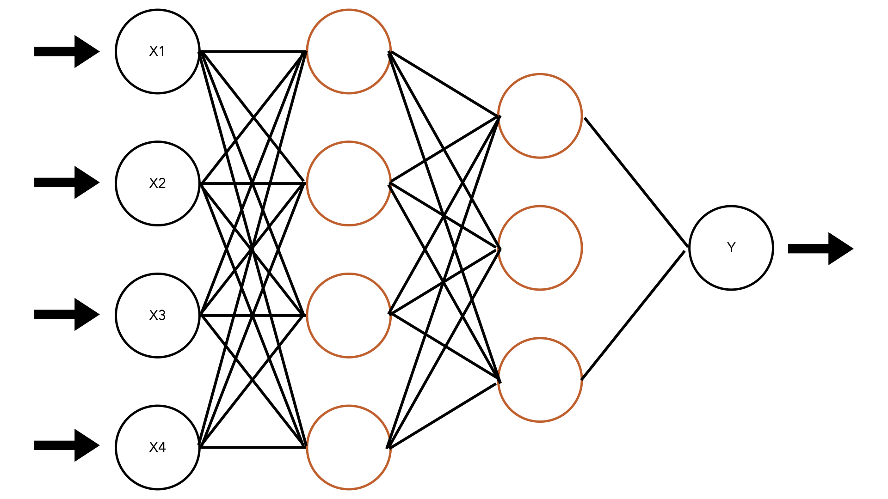
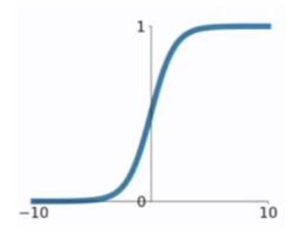
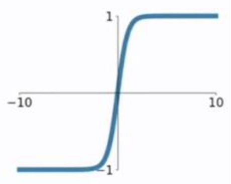
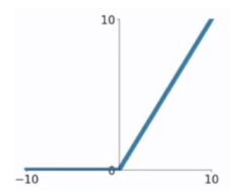
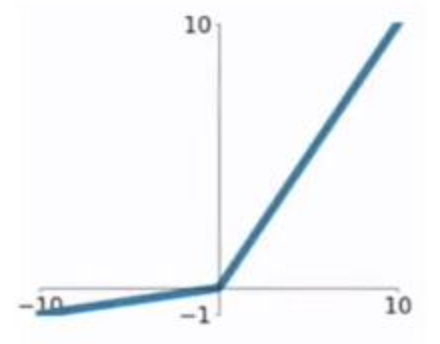

# 神经网络基础

> **Author: [StevenChaoo](https://github.com/StevenChaoo)**

## 目录

- [神经网络基础](#神经网络基础)
  - [目录](#目录)
  - [1. 神经网络结构](#1-神经网络结构)
    - [1.1 神经元 & 单层感知机](#11-神经元--单层感知机)
    - [1.2 多层神经网络](#12-多层神经网络)
  - [2. 误差函数](#2-误差函数)
    - [2.1 均方误差](#21-均方误差)
    - [2.2 交叉熵误差](#22-交叉熵误差)
  - [3. 激活函数](#3-激活函数)
    - [3.1 为什么要用激活函数？](#31-为什么要用激活函数)
    - [3.2 Sigmoid](#32-sigmoid)
    - [3.3 Tanh](#33-tanh)
    - [3.4 ReLU](#34-relu)
    - [3.5 Leaky ReLU](#35-leaky-relu)
  - [4. 反向传播](#4-反向传播)
    - [4.1 梯度](#41-梯度)
    - [4.2 梯度消失 & 梯度爆炸](#42-梯度消失--梯度爆炸)

## 1. 神经网络结构

人工神经网络又称神经网络，是计算机模拟人脑神经网络设计的一种网络，期望能够通过神经元产生反应来学习到需要学习的结果

### 1.1 神经元 & 单层感知机

神经网络由多层神经元群组成，由**泰勒展开公式**
$$ f(x)=\frac{f(x_0)}{0!}+\frac{f^{'}(x_0)}{1!}(x-x_0)+...+\frac{f^{(n)}(x_0)}{n!}(x-x_0)^n+R_n(x) $$
可知，一个特定的函数可以分解为多个非线性函数的加和，也可以说当多个非线性函数加和时，可以模拟出某一个特定的函数

基于这个想法，我们将输入的$ x $，匹配某个权重$ w $，再增添某个偏置$ b $，就可以得到对于输入$ x $的线性函数。再将结果输入某个**激活函数**中，得到最终结果。
$$ f(x)=sign(wx+b) $$
我们将由输入空间到输出空间的到的函数称为感知机器

### 1.2 多层神经网络

多个神经元以全连接形式层次相连，形成的网络称为前馈神经网络，也称为多层感知机（MLP），由泰勒展开可以得知，MLP理论上可以模拟所有函数

	

其中：

- **模型为**：$ y = F(x) $
- **训练集为**：$ D=\{x_i,y_i\}^n_{i=1} $
- **预测值为**：$ \hat{y_i}=F(x_i) $
- **目标为**：$ \mathrm{min}(|\hat{y_i}-y_i|) $

## 2. 误差函数

常用的误差函数为：

### 2.1 均方误差

$$ MSE = \frac{1}{m}\sum^m_{i=1}{(y_i-\hat{y_i})^2} $$
这种损失函数通常用在实数数值连续变量的回归问题上，并且对残差较大的情况给予更多的权重

### 2.2 交叉熵误差

$$ E=-\sum_kt_k\mathrm{ln}y_k $$
$ y_k $是神经网络的输出，$ t_k $是正确解得标签。而且$ t_k $中只有正确解得标签的索引为1，其余均为0
$$ E=-\frac{1}{N}\sum_n\sum_kt_{nk}\mathrm{ln}y_{nk} $$
第一个公式是针对单个数据的损失函数，第二个公式要求所有损失函数的总和
假设数据一共有$ N $个，$ t_{nk} $表示第$ n $个数据的第$ k $个元素的值。其实就是把单个损失函数扩大了$ N $份，最后再除以$ N $，求平均损失函数

## 3. 激活函数

### 3.1 为什么要用激活函数？

如果神经网络没有进行可以提取非线性特征的卷积操作，而且该神经网络也不用激活函数，那么这个神经网络第i层输出只有$ wx_i+b $。这样此神经网络不论有多少层，第$ i $层的输出都是一个关于第$ i $层输入$ x_i $的线性组合，相当于此时多层神经网络退化为一个多层的线性回归模型，难以学习如图像、音频、文本等复杂数据的特征

正因为这个原因，神经网络要引入激活函数来给神经网络增加一些非线性的特性，所以目前常见的激活函数大多是非线性函数。这样神经网络中下一层得到的输入不再是线性组合了

### 3.2 Sigmoid

	

函数为：
$$ g(z)=\frac{1}{1+e^{-z}} $$
导数为：
$$ g^{'}(z)=g(z)(1-g(z)) $$
Sigmoid有以下缺点：

- 当$ z $非常小或者非常大的时候，sigmoid函数的导数接近0。这导致权重$ w $的梯度将会接近0，使得梯度更新十分缓慢，即**梯度消失（梯度弥散）**
- 函数的输出**不是以0为均值**，不便与下一层的计算，所以一般用于网络的最后一层，作为二分类的结果输出

### 3.3 Tanh

  

函数为：
$$ g(z)=\frac{e^z-e^{-z}}{e^z+e^{-z}} $$
导数为：
$$ g^{'}(z)=1-g^2(z) $$
tanh函数在0的附近可以看作是线性的，由于其**均值是0**，所以弥补了sigmoid函数均值不为0的缺点，但是仍然存在**梯度消失（梯度弥散）**

### 3.4 ReLU

  

函数为：
$$g(z)=\begin{cases}
0 & z<0 \\
z & z>0
\end{cases}$$
导数为：
$$g^{'}(z)=\begin{cases}
0 & z<0 \\
1 & z>0
\end{cases}$$
ReLU函数的优点：

- 在输入为正数的时候（对于大多数输入$ z $空间来说），不存在梯度消失问题
- 计算速度要快很多。ReLU函数只有线性关系，不管是前向传播还是反向传播，都比sigmod和tanh要快很多。（sigmod和tanh要计算指数，计算速度会比较慢）

ReLU函数的缺点：

- 当**输入为负**时，梯度为0，会产生**梯度消失**问题

### 3.5 Leaky ReLU

  

函数为：
$$g(z)=\begin{cases}
az & z<0 \\
z & z>0
\end{cases}$$
导数为：
$$g^{'}(z)=\begin{cases}
a & z<0 \\
1 & z>0
\end{cases}$$
Leaky ReLU解决了ReLU函数在输入为负的情况下产生的梯度消失问题

## 4. 反向传播

通过多层感知机，我们可以得到最终的函数为：
$$ y=F(x)=f_3(W_3,f_2(W_2,f_1(W_1,x))) $$
并且通过**梯度下降法**优化目标：
$$ E=\frac{1}{2}\sum_{i=1}^n(y_i-\hat{y_i})^2 $$

### 4.1 梯度

梯度是误差对于权重的偏导数，误差通过下面的公式更新参数：
$$ W^{t+1}=W^t-\eta_t\frac{\partial E}{\partial W} $$
由于偏导数存在链式法则，我们可以通过从后向前反向传播的方式计算梯度
$$ \frac{\partial E}{\partial W_1}=\frac{\partial E}{\partial f_3}\centerdot\frac{\partial f_3}{\partial f_2}\centerdot\frac{\partial f_2}{\partial f_1}\centerdot\frac{\partial f_1}{\partial W_1} $$
但是梯度下降法存在以下问题：

- 目标函数通常不是标准的凸函数，所以非常容易陷入局部最优解而不是全局最优解
- 网络层数增多后，容易出现梯度消失或者梯度爆炸问题

### 4.2 梯度消失 & 梯度爆炸

梯度消失通常由于网络过于深层或者采用了不适合的损失函数。例如对于一个三层的全连接网络，其链式求导结果为
$$ \frac{\partial E}{\partial W_1}=\frac{\partial E}{\partial f_3}\centerdot\frac{\partial f_3}{\partial f_2}\centerdot\frac{\partial f_2}{\partial f_1}\centerdot\frac{\partial f_1}{\partial W_1} $$
如果对于其中每一个偏导数$ \frac{\partial f_n}{\partial f_{n-1}} $，这一部分大于1，那么随着网络层数的增加，求出的梯度更新将以指数形式增加，发生梯度爆炸；反言之，如果这一部分小于1，那么最终求出的结果将会以指数形式衰减，发生梯度消失。

> 参考来源：
> 1. https://blog.csdn.net/weixin_43789781/article/details/109207778
> 2. https://zhuanlan.zhihu.com/p/68579467
> 3. https://www.cnblogs.com/lliuye/p/9486500.html
> 4. http://ddrv.cn/a/579469#:~:text=2%20常见的激活函数%201%201%20逻辑函数Sigmoid%20%5B1%5D%202,2%20双曲正切函数tanh%20%5B2%5D%203%203%20线性整流函数ReLU%20%5B3%5D
> 5. 《python深度学习基于TensorFlow》