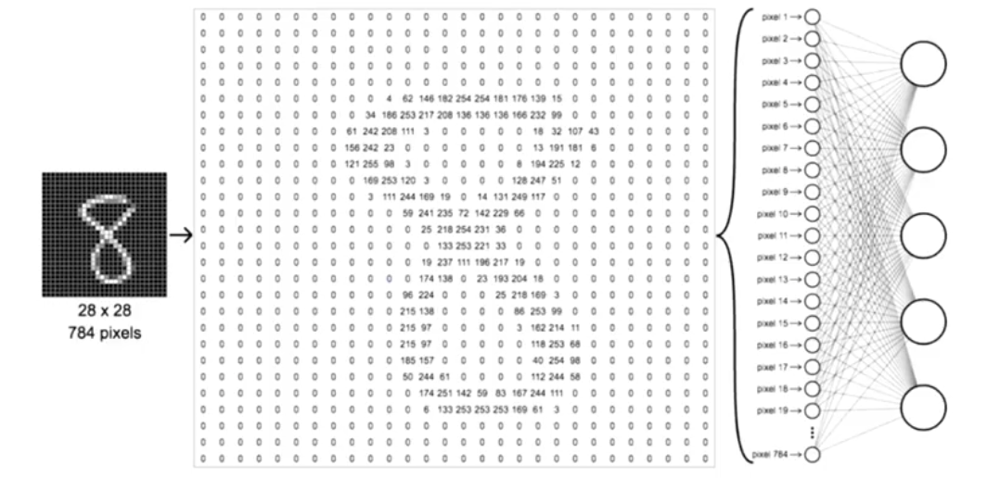
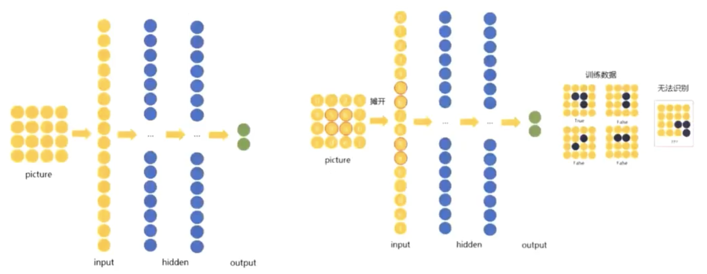
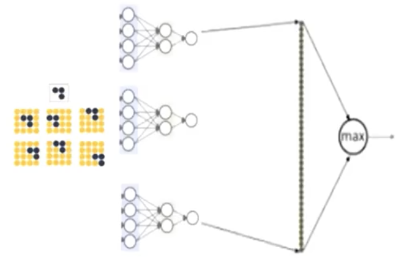
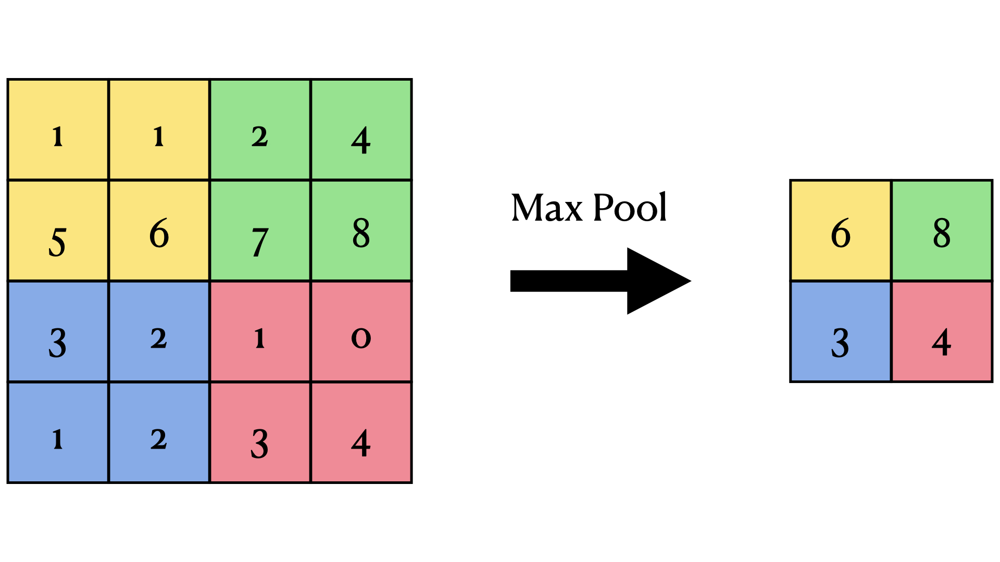
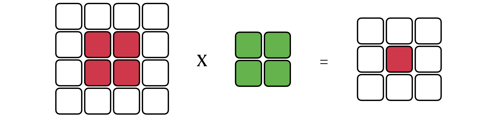

# 卷积神经网络（CNN）

> **Author: [StevenChaoo](https://github.com/StevenChaoo)**

## 目录

- [卷积神经网络（CNN）](#卷积神经网络cnn)
  - [目录](#目录)
  - [1. 预备知识](#1-预备知识)
    - [1.1 基本概念](#11-基本概念)
    - [1.2 全连接](#12-全连接)
    - [1.3 权值共享](#13-权值共享)
    - [1.4 下采样](#14-下采样)
  - [2. CNN的结构](#2-cnn的结构)
    - [2.1 卷积层](#21-卷积层)
    - [2.2 池化层](#22-池化层)

## 1. 预备知识

人眼通过视觉神经获取视觉信息并在大脑皮层对获取到的信息进行分析，对于计算机来说，科学家通过猫的“感受野”提出了**step-by-step**的**filter**结构。每一层都对这一个图像的不同结构接受刺激并产生反应。卷积神经网络是基于这一结构进行设计的。

### 1.1 基本概念

### 1.2 全连接

对于图像来说，多个像素点组成了一张图像。如果直接使用MLP来识别手写体，那么第一步就需要将所有像素点分开排列形成一个列向量。

    

比如手写数字这个任务，我们可以从上图看出，一张图片中只有很少的部分是非0值，大部分像素都是冗余干扰，这导致了原本图像中相邻节点的位置关系彻底被打破，原本具有相关性的两个节点之间的相关性无法在MLP中保留。

    

而且由于图像的像素很多，所以在整理成列向量的时候会导致神经元个数过多，训练复杂度增大。

### 1.3 权值共享

既然MLP对位置信息并不敏感，那么可以将固定位置的信息当作一个节点进行训练，我们将这个携带固定位置信息的结构叫做一个pattern，通过移动pattern来对全局的位置信息进行学习。

    

这样就形成了多个MLP来学习某一张图片的不同位置的结构，既然使用同一个pattern来学习，所以这一批次中所有MLP使用的权重$ W $和$ b $是相同的，也就是说，同一批次的所有MLP之间是权值共享的。

### 1.4 下采样

下采样是通过将高维的矩阵转换成低维矩阵的一种方法。下图是一个2x2的pattern以步长为2进行下采样的示例：

    

## 2. CNN的结构

CNN由输入层、卷积层、池化层和全连接层组成，上文中提到的pattern是这里卷积层中的卷积核，通过移动卷积核来对图片进行卷积学习。卷积层和池化层交替出现进行迭代，最终通过全连接层将特征拼接起来并送入分类器中进行结果输出。

### 2.1 卷积层

上一层输出的特征图和卷积层进行卷积操作，即输入和卷积核之间进行矩阵点积计算，然后将结果送入激活函数中，就可以得到这一层的输出。其中$ l $代表第$ l $层卷积层。
$$ a_j^l=f(b_j^l+\sum_{i\in M_j^l}a_i^{l-1}\times k_{ij}^l) $$

**示意图**：

    

### 2.2 池化层

池化层拼接在卷积层之后，两者相互交替出现。
$$a_j^l=f(b_j^l+\beta_j^ldown(a_j^{l-1},M^l)) $$
常见的池化函数有：

- Mean-Pooling：均值池化
- Max-Pooling：最大值池化
- Min-Pooling：最小值池化
- Stochastic-Pooling：随机池化

**示意图**：

    

> 参考来源
> 1. https://zhuanlan.zhihu.com/p/51678022
> 2. https://zhuanlan.zhihu.com/p/47184529
> 3. 博雅大数据学院