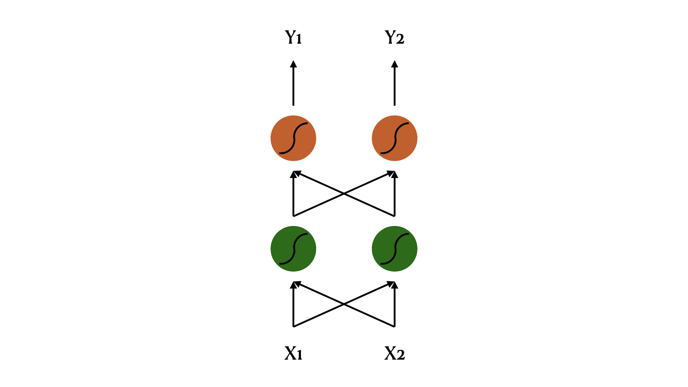
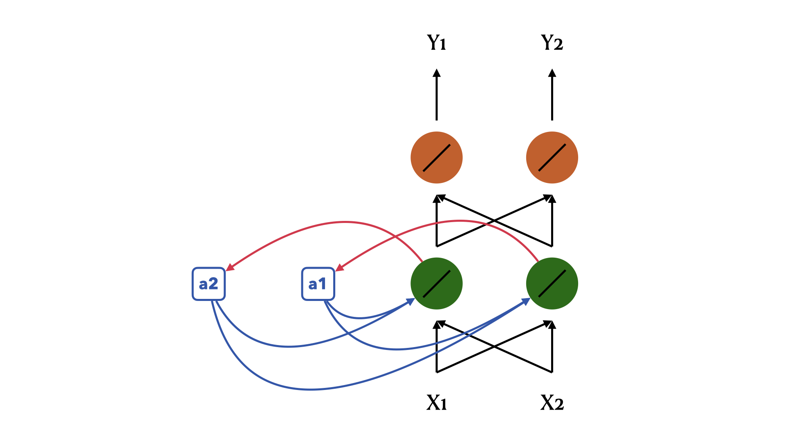
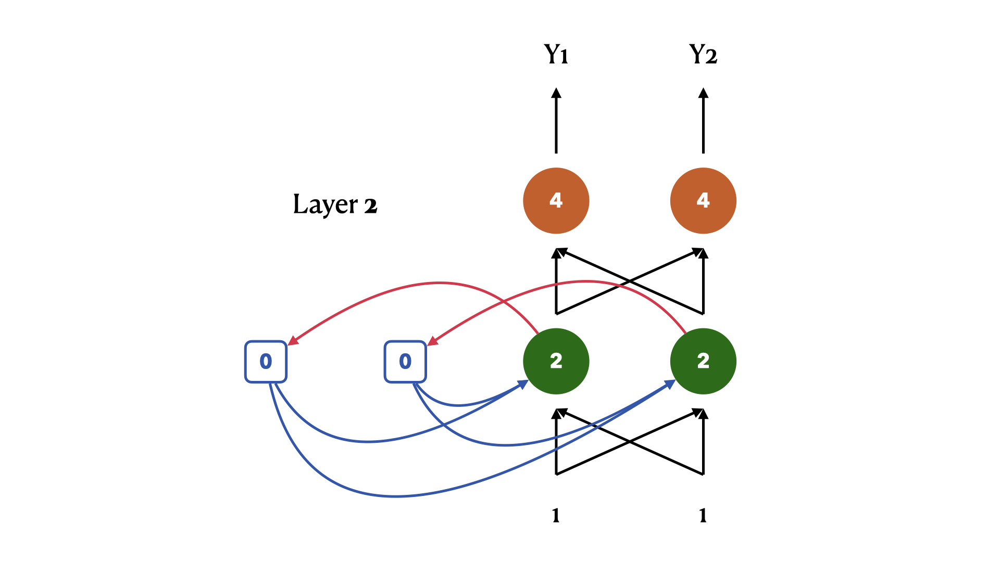
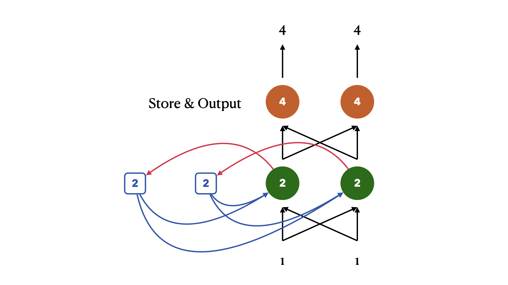
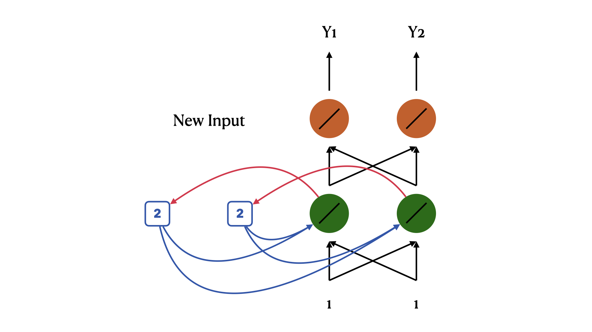
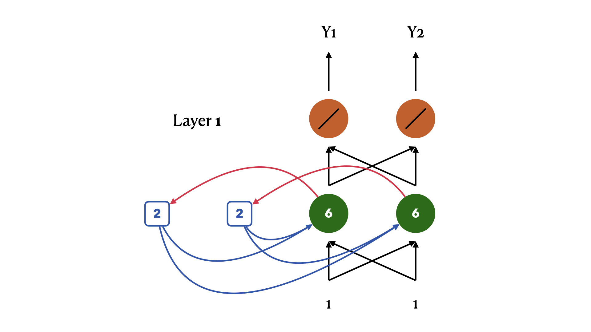
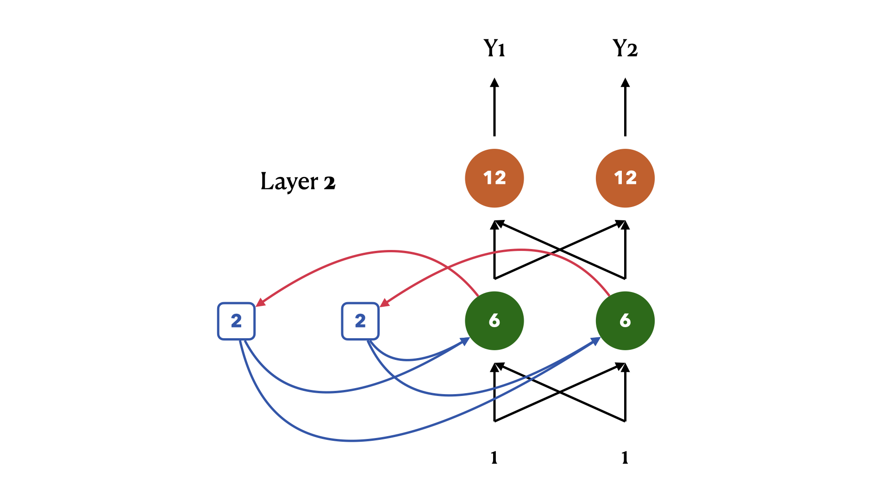
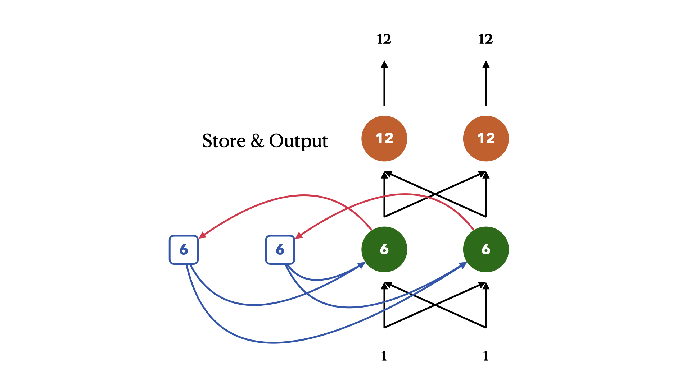
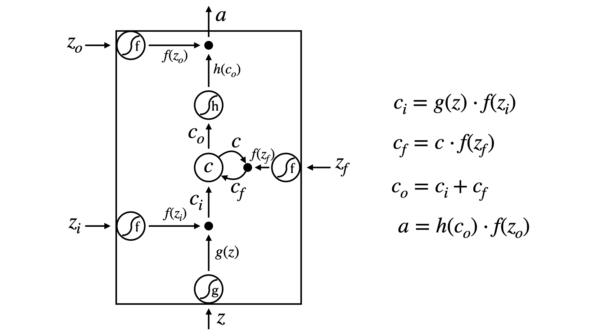
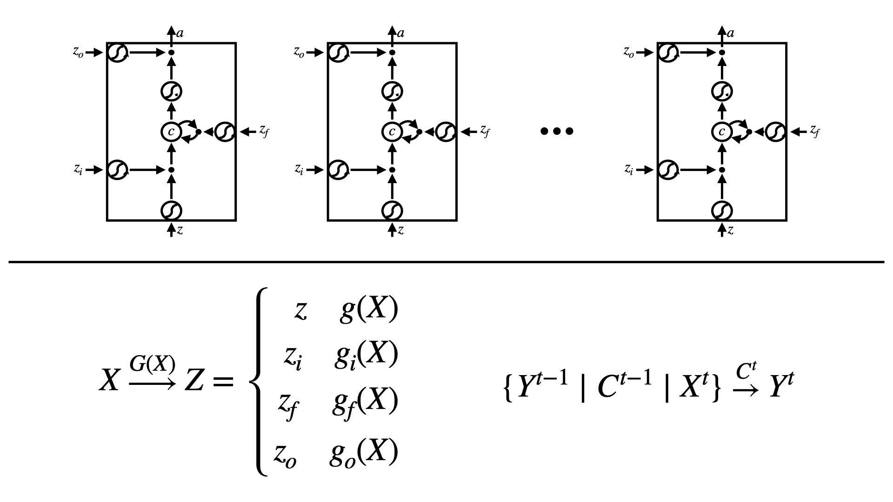

# Recurrent Neural Network

> **Author: [StevenChaoo](https://github.com/StevenChaoo)**

This blog is written by **Neovim** and **Visual Studio Code**. You may need to clone this repository to your local and use **Visual Studio Code** to read. ***Markdown Preview Enhanced*** plugin is necessary as well. You can also read it [here](https://stevenchaoo.github.io/2021/03/30/Foundations-of-LSTM).

## Contents

- [Recurrent Neural Network](#recurrent-neural-network)
  - [Contents](#contents)
  - [1. Slot Filling Task](#1-slot-filling-task)
    - [1.1 Task Definition](#11-task-definition)
    - [1.2 Feedforward Neural Network](#12-feedforward-neural-network)
      - [1.2.1 Input](#121-input)
      - [1.2.2 Output](#122-output)
      - [1.2.3 Drawbacks](#123-drawbacks)
  - [2. Recurrent Neural Network](#2-recurrent-neural-network)
    - [2.1 A quick demo for RNN](#21-a-quick-demo-for-rnn)
    - [2.2 Other RNN models](#22-other-rnn-models)
      - [2.2.1 Elman Network & Jordan Network](#221-elman-network--jordan-network)
      - [2.2.2 Bidirectional RNN](#222-bidirectional-rnn)
  - [3. Long Short-Term Memory](#3-long-short-term-memory)
    - [3.1 Simple explaination for LSTM](#31-simple-explaination-for-lstm)
    - [3.2 Advantages of LSTM](#32-advantages-of-lstm)
      - [3.2.1 Drawbacks of RNN](#321-drawbacks-of-rnn)
      - [3.2.2 Helpful Techniques](#322-helpful-techniques)
    - [3.3 Gated Recurrent Unit](#33-gated-recurrent-unit)
  - [4. RNN/LSTM v.s. Structured Learning](#4-rnnlstm-vs-structured-learning)
    - [4.1 Speech Recognition](#41-speech-recognition)
    - [4.2 Semantic Tagging](#42-semantic-tagging)
  - [REFERENCE](#reference)

## 1. Slot Filling Task

### 1.1 Task Definition

What is slot? In this sentence: *I would like to arrive Taipei on November 2nd*. We got two important informations--**destination** and **time of arrival**. We call this two functional position **slot**. The next thing is obvious, if there are no words in these two positions, then we need to fill these two slots. That is **Slot Filling Task**.

Through the example above, we know that **Taipei** should be filled into the slot of the **destination** and **November 2nd** should be filled into **time of arrival**.

### 1.2 Feedforward Neural Network

First of all, we can easily think of using feedforward neural network to accomplish this task.

Network above describes the process of feedforward neural network. Program will go through **input train** and **output**.

#### 1.2.1 Input

At the very beginning, we need to input a series of vectors. There are lots of embedding ways to convert a integer to a vector. In this task, each word is represented as a vector.

One of the most common is **One-Hot encoding**. The vector is lexicon size. Each dimension corresponds to a word in the lexicon. The dimension for the word is 1, and others are 0. If the word is a new one for this dictionary, put it into **other** dimension.
$$\mathrm{lexicon}=\{apple, bag, cat, dog, elephant, other\}\\
\downarrow\\
\begin{bmatrix}
apple\\bag\\cat\\dog\\elephant\\other
\end{bmatrix}=
\begin{bmatrix}
1&\cdots&0\\
\vdots&\ddots&\vdots\\
0&\cdots&1
\end{bmatrix} \tag{1}$$

#### 1.2.2 Output

We expect we can recieve a set of probability distribution that the input word belonging to the slots so that we can determine which words should we put in the slot.

#### 1.2.3 Drawbacks

FFNN has a fatal error that this **model can not recognize elements beyond the slot sets**.

For example, two sentences has completly meaning but FFNN may consider same words thould be filled in the same slot.

... <b>arrive</b> Taipei on November 2nd ...

... <b>leave</b> Taipei on November 2nd ...

And thus, we hope our FFNN has memory. It would know the previous word before it see the current word.

**We call FFNN with memory a recurrent neural network.**

## 2. Recurrent Neural Network

### 2.1 A quick demo for RNN

The main idea of RNN is that the ouput of hidden layer are stored in the memory. And memory can be considered as another input.

For ease of understanding, we consider that all the weights are 1 and there is no bias in this network.

Initialize $a$ is 0, our **input sequence** is:
$$\left[
    \begin{matrix}
    1 & 1 & 2 \\
    1 & 1 & 2
\end{matrix}\ \ \ \cdots
\right] \tag{2}$$

- EPOCH 1
  - STEP 1: 
  - STEP 2: 
  - STEP 3: 
- EPOCH 2
  - STEP 1: 
  - STEP 2: 
  - STEP 3: 
  - STEP 4: 

After multiple rounds of training, we get the **output sequence** as:
$$\left[
    \begin{matrix}
    4 & 12 & 32 \\
    4 & 12 & 32
\end{matrix}\ \ \ \cdots
\right] \tag{3}$$

There is a very important thing we need to know that **changing the sequence order will change the output. Even same input will get different output under different memory.**

Going back to the previous example, through RNN, we may be able to solve the above problems because the values stored in the memory is different so that we may get different output.

### 2.2 Other RNN models

#### 2.2.1 Elman Network & Jordan Network

  <image src="../Pics/21.jpeg" width=70%>

#### 2.2.2 Bidirectional RNN

  <image src="../Pics/22.jpeg" width=70%>

## 3. Long Short-Term Memory

### 3.1 Simple explaination for LSTM

LSTM is a special RNN memory module. Different from normal RNN model, LSTM has **three gates** to determine what kind of information can be stored in memory module.

- **Input Gate**: Determine which vector can influence input
- **Forget Gate**: Determine what kind of information should be forgotten
- **Output Gate**: Determine whether output should be influenced by previous output

So, you can consider that LSTM has a special neuron with **4 inputs** and **1 output**.

Let's make a demo with numbers. Our input is vector $X_{3\times9}$, output vector is $Y_{1\times9}$ and memory vector is $M_{1\times9}$. We make some rules for gates:

- When $x_2=1$, add the numbers of $x_1$ into the memory
- When $x_2=-1$, reset the memory
- When $w_3=1$, output the number in the memory

Thus we can express the input and memory as follows:
$$
\left[\begin{array}{}
X\\
\hdashline M\\
\end{array}\right]=
\left[\begin{array}{}
1&3&2&4&2&1&3&6&1\\
0&1&0&1&0&0&-1&1&0\\
0&0&0&0&0&1&0&0&1\\
\hdashline 0&0&3&3&7&7&7&0&6
\end{array}\right]
\tag{4}
$$

Give input $W$ vector as weight, we can compute the output vector as follow:
$$
Y=\begin{bmatrix}
0&0&0&0&0&7&0&0&6
\end{bmatrix} \tag{5}
$$

Because of 4 times of input, **LSTM has 4 times of parameters than RNN or a normal FFNN**. Obviously, **overfitting is also easier**.

Definitely, LSTM can not be only one layer and its input can not be so simple. Here are the details of LSTM. Upon this we could find out that LSTM is a very complex neuron but works.

### 3.2 Advantages of LSTM

#### 3.2.1 Drawbacks of RNN

Like others neural network, RNN needs backpropagation to update weights and bias as well.
$$w\to w-\eta\frac{\partial L}{\partial w} \tag{6}$$

Unfortunately, RNN-based network is not always easy to learn because total loss of model will be very vertical up and down.

The error surface of RNN is rough. The error surface is either very flat or very steep. A simple try is setting a threshold, as long as the result exceeds this threshold, then the value is changed to this threshold to continue the next round of training.

But why? Let's take a simple example. Assuming that we have a very very simple network with one layer a neuron without any active function. For each neuron, there are only one data-input, one output and one memory-input.

Now, we set data input sequence is $1000\cdots000$. The final output is as followed.
$$
\begin{align}
w&=1&\to\quad y^{1000}&=1\\
w&=1.01&\to\quad y^{1000}&\approx20000 \tag{7}
\end{align}
$$

Too large $\frac{\partial L}{\partial w}$ needs smaller learning rate.
$$
\begin{align}
w&=0.99&\to\quad y^{1000}&\approx0\\
w&=0.01&\to\quad y^{1000}&\approx0 \tag{8}
\end{align}
$$

Too small $\frac{\partial L}{\partial w}$ needs larger learning rate. But learning rate can not be so varible. The reason for this problem is that as time continues to increase, weight is cocnstantly iterating.

#### 3.2.2 Helpful Techniques

Why LSTM but RNN? Because LSTM can deal with gradient vanishing (not gradient explode). Thus you can set your learning rate at a very little position.

Memory and input of LSTM are added not cleaned. The influence never disappears unless forget gate is closed. Thus if forget gate is opened, there is no gradient vanishing.

And due to that solution, you have to make sure forget gate always opens by giving forget gate a big bias.

### 3.3 Gated Recurrent Unit

A simpler model than LSTM. GRU only has two gates, conbining input gate and forget gate, to compute data. Simplily saying is that when input gate is open, forget gate will close at the same time which means clean memory. If there is no data to clean, input gate will be shut.

## 4. RNN/LSTM v.s. Structured Learning

- **RNN/LSTM**
  - Unidirectional RNN does not consider the whole sequence
  - Cost and error not always related
  - But RNN/LSTM as a network can be very deep
- **Structured Learning**
  - Using Viterbi, so consider the whole sequence
  - Can explicitly consider the label dependency
  - Cost is the upper cound of error

In summary, it seems like that structured learning has more power than RNN/LSTM. However, **neural network can be very deep** so that there is no limited performance.

Besides, RNN/LSTM and structured learning are not opposing. Integrating them together can not only explicitly model the dependency but also cost of it is the upper bound of error.

### 4.1 Speech Recognition

To solve this problem, we can conbine RNN/LSTM and HMM together.

Here is equation of HMM:
$$P(x,y)=P(y_1\mid\mathrm{start})\prod_{l=1}^{L-1}P(y_{l+1}\mid y_l)P(\mathrm{end}\mid y_L)\prod_{l=1}^LP(x_l\mid y_l) \tag{9}$$

Output of RNN/LSTM is a series of conditional probability like $P(a\mid x_l)\quad P(b\mid x_l)\cdots$. We consider that the output of RNN/LSTM can be the last part of input of HMM -- $P(x_l\mid y_l)$. We can determine $P(x_l)=1$ because of we must input x:
$$P(x_l\mid y_l)=\frac{P(x_l,y_l)}{P(y_l)}=\frac{P(y_l\mid x_l)P(x_l)}{P(y_l)}\\
\downarrow\\
P(x_l\mid y_l)=\frac{P(x_l,y_l)}{P(y_l)}=\frac{P(y_l\mid x_l)}{P(y_l)} \tag{10}$$

### 4.2 Semantic Tagging

To solve this problem, we can conbine BiLSTM and CRF/Structured SVM

Considering output of BiLSTM as the input of CRF/Structured SVM -- $w\cdot\phi(x,y)$.

## REFERENCE

1. Related courses at [National Taiwan University](https://www.ntu.edu.tw) [Hung-yi Lee](https://speech.ee.ntu.edu.tw/~tlkagk/)
