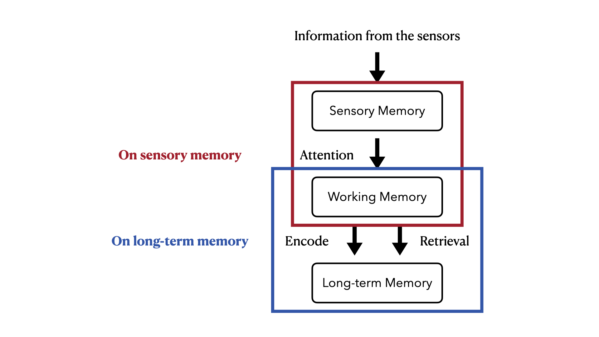
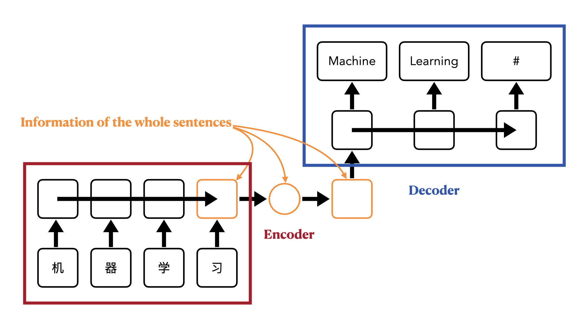
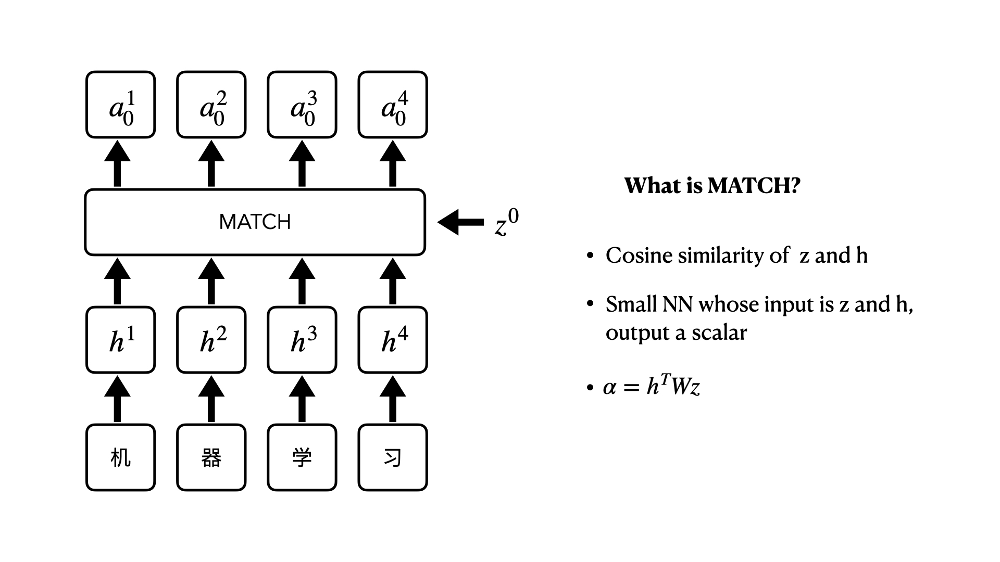
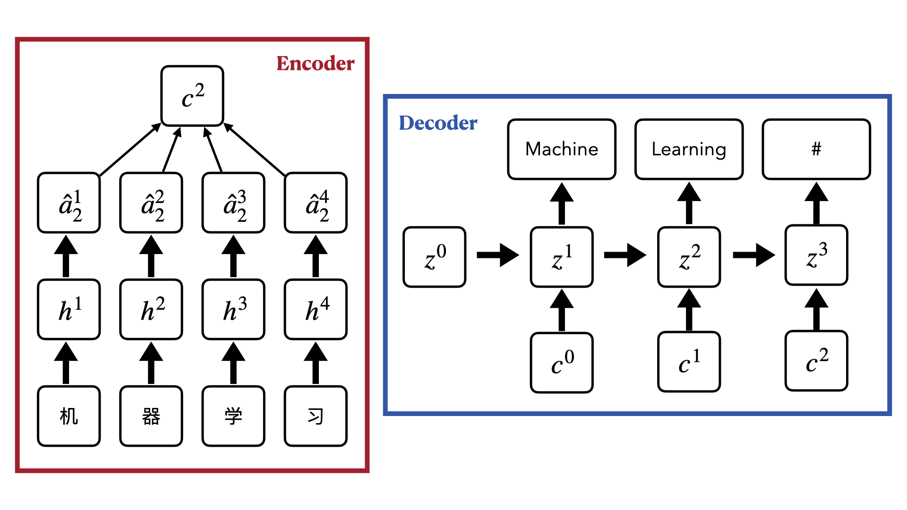

# Attention

> **Author: [StevenChaoo](https://github.com/StevenChaoo)**

This blog is written by **Neovim** and **Visual Studio Code**. You may need to clone this repository to your local and use **Visual Studio Code** to read. ***Markdown Preview Enhanced*** plugin is necessary as well. You can also read it [here]().

## Contents

- [Attention](#attention)
  - [Contents](#contents)
  - [1. Attention-based Model](#1-attention-based-model)
    - [1.1 Using RNN/LSTM](#11-using-rnnlstm)
    - [1.2 Using Attention-based Model](#12-using-attention-based-model)
  - [2. Self-Attention](#2-self-attention)

## 1. Attention-based Model

For human, the memory of information can be divided into three parts according to the time of existence -- Sensory memory, Working memory and Long-term memory.

Attention on this model can be divided into two parts. Paying attention on sensory memory and paying attention on long-term memory.

When the input is a very long sequence or an image, model can pay attention on partial of the input object each time. And in RNN/LSTM, larger memory implies more parameters. Model can pay attention on increasing memory size will not increasing parameters.

Taking sequencs to sequence learning as example, Seq2Seq is defined as both input and output are both sequences **with different lengths**. How to deal with Seq2Seq task?

### 1.1 Using RNN/LSTM

We usually use the enc2dec model. As we know, the input of RNN/LSTM can be one or more, and the output is the same.

So we can input the raw sequence in A language into a RNN/LSTM model and take the very last hidden layer as the output which is usually thought of as storing the entire information of sentence.

After that, we use this output as the input of a new RNN/LSTM model. In this RNN/LSTM, we only let the output of the previous hidden layer as the input of the next layer. Each layer is expected to have a corresponding output, this output is the language we need to translate into B.

### 1.2 Using Attention-based Model

What is different from each layer's output is, in this model, we only trust the very last hidden layer can contain every information of the whole sentence. This is often counterproductive. We need attention-based model.

Initialize a vector $z^0$. Using a MATCH function to compute $h^i$ and $z^0$ with output $\alpha_0^i$. Here are some choises of MATCH selection.

The result obtained is then passed through the softmax function to get the normalized value $\hat{\alpha}$. Then use $c^l=\sum\hat{\alpha}_l^ih^i$ to calculate the RNN input at the first moment in the decoder.

Repeat this step until the RNN in the decoder generate a termination result.

## 2. Self-Attention

