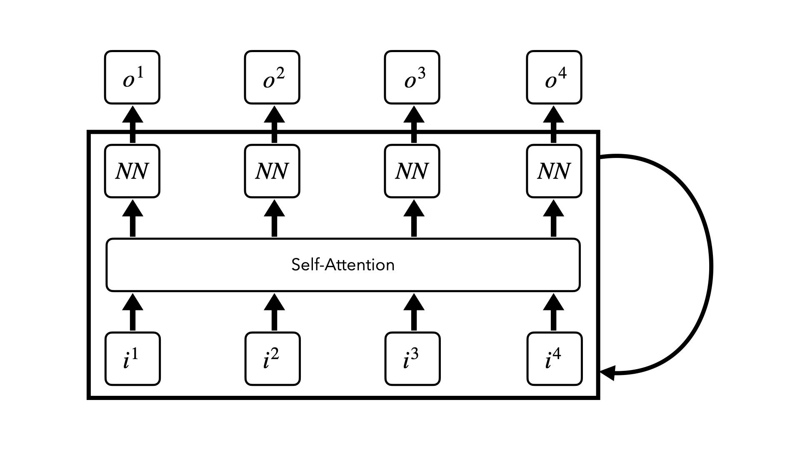
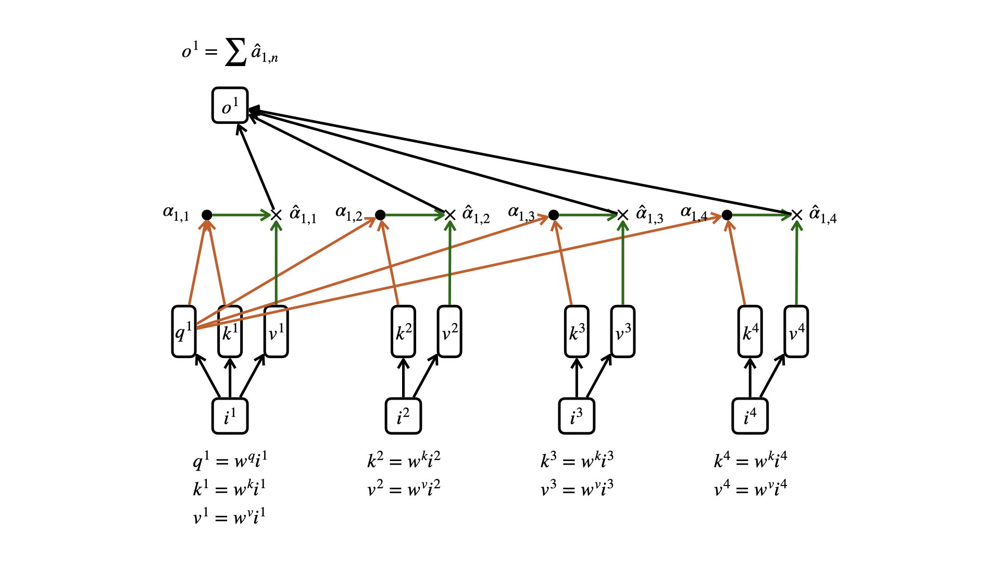
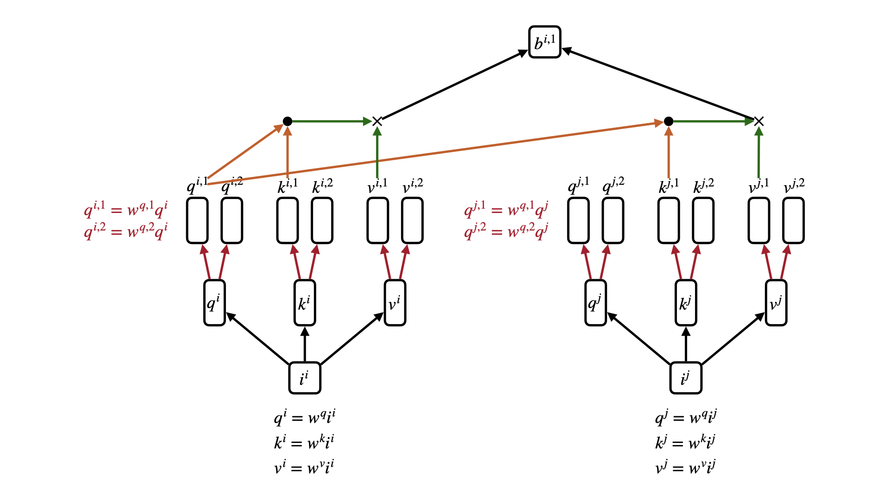

# Transformer

> **Author: [StevenChaoo](https://github.com/StevenChaoo)**

This blog is written by **Neovim** and **Visual Studio Code**. You may need to clone this repository to your local and use **Visual Studio Code** to read. ***Markdown Preview Enhanced*** plugin is necessary as well. You can also read it [here](https://stevenchaoo.github.io/2021/04/07/Transformer/).

## Contents

- [Transformer](#transformer)
  - [Contents](#contents)
  - [1. Attention](#1-attention)
    - [1.1 Attention-based Model](#11-attention-based-model)
      - [1.1.1 Using RNN/LSTM](#111-using-rnnlstm)
      - [1.1.2 Using Attention-based Model](#112-using-attention-based-model)
    - [1.2 Self-Attention](#12-self-attention)
      - [1.2.1 Computing Process](#121-computing-process)
      - [1.2.2 Multi-Head Self-Attention](#122-multi-head-self-attention)
  - [2. Transformer](#2-transformer)
    - [2.1 Encoder](#21-encoder)
    - [2.2 Decoder](#22-decoder)
  - [REFERENCE](#reference)

## 1. Attention

### 1.1 Attention-based Model

For human, the memory of information can be divided into three parts according to the time of existence -- Sensory memory, Working memory and Long-term memory.

Attention on this model can be divided into two parts. Paying attention on sensory memory and paying attention on long-term memory.

When the input is a very long sequence or an image, model can pay attention on partial of the input object each time. And in RNN/LSTM, larger memory implies more parameters. Model can pay attention on increasing memory size will not increasing parameters.

Taking **sequencs to sequence** learning as example, Seq2Seq is defined as both input and output are both sequences **with different lengths**. How to deal with Seq2Seq task?

#### 1.1.1 Using RNN/LSTM

We usually use the enc2dec model. As we know, the input of RNN/LSTM can be one or more, and the output is the same.

So we can input the raw sequence in A language into a RNN/LSTM model and take the very last hidden layer as the output which is usually thought of as storing the entire information of sentence.

After that, we use this output as the input of a new RNN/LSTM model. In this RNN/LSTM, we only let the output of the previous hidden layer as the input of the next layer. Each layer is expected to have a corresponding output, this output is the language we need to translate into B.

#### 1.1.2 Using Attention-based Model

What is different from each layer's output is, in this model, we only trust the very last hidden layer can contain every information of the whole sentence. This is often counterproductive. We need attention-based model.

Initialize a vector $z^0$. Using a MATCH function to compute $h^i$ and $z^0$ with output $\alpha_0^i$. Here are some choises of MATCH selection.

The result obtained is then passed through the softmax function to get the normalized value $\hat{\alpha}$. Then use $c^l=\sum\hat{\alpha}_l^ih^i$ to calculate the RNN input at the first moment in the decoder.

Repeat this step until the RNN in the decoder generate a termination result.

### 1.2 Self-Attention

Actually, we consider that attention is a map from QUERY to a series KEY-VALUE. The calculation method is to first calculate the similarity or correlation between the QUERY ($z_i$) and each KEY ($h_i$) to obtain the weight coefficient of each KEY's corresponding VALUE ($\hat{a}_i$), and then perform a weighted sum on the VALUE to obtain the final attention value ($c_i$).

So in essence, the attention mechanism is to perform a weighted summation of the VALUE values of the elements in the source, and the QUERY and KEY are used to calculate the weight coefficient of the corresponding VALUE.

In contrast to this, self-attention can be considered as a special attention with equal QUERY, KEY and VALUE. Do attention inside the sequence to find the connections inside the sequence.

#### 1.2.1 Computing Process

We now have an input sequence $i$, self-attention is to learn the correlation between them within this sequence. Now we are going to learn the correlation between $i^1$ and other elements in the sequence. Separately operate $i^1$ and $W^q$ to obtain the query value $q^1$ of $i^1$, and then multiply the input matrix $I$ by the weight $W^k$ to obtain the correlation matrix $K$. Matrix $K$ is multiplied by $q^1$ to get attention matrix $\alpha$. Normalize the attention matrix $\alpha$, and get $\hat{\alpha}$ through a layer of softmax. Then multiply the input matrix $I$ by the weight matrix $W^v$ to obtain the hidden layer matrix $V$, and multiply and add each item of the matrix $V$ and $a^1$ to obtain the final output $O$.

Here are equations of computing. In this way, we can give higher weight to the most influential elements, and have more attention when calculating the output. What we learn is weight $W^q$, $W^k$, $W^v$.
$$
\begin{align}
\begin{bmatrix}Q&K&V\end{bmatrix}^\intercal
&=
\begin{bmatrix}W^q&W^k&W^v\end{bmatrix}^\intercal
\begin{bmatrix} I \end{bmatrix}
\\\\
\begin{bmatrix} \hat{\alpha} \end{bmatrix}
\xleftarrow{softmax}
\begin{bmatrix} \alpha \end{bmatrix}
&=
\begin{bmatrix} K^\intercal \end{bmatrix}
\begin{bmatrix} Q \end{bmatrix}
\\\\
\begin{bmatrix} O \end{bmatrix}
&=
\begin{bmatrix} V \end{bmatrix}
\begin{bmatrix} \hat{\alpha} \end{bmatrix}
\end{align} \tag{1}
$$

#### 1.2.2 Multi-Head Self-Attention

The so-called multi-head is to multiply each query, key and value by a weight matrix to form multiple q, k, v.

## 2. Transformer

[*Attention Is All You Need*](https://papers.nips.cc/paper/2017/file/3f5ee243547dee91fbd053c1c4a845aa-Paper.pdf) firstly proposed the concept of Transformer. Based on self-attention, transformer is also divided into two parts: encoding and decoding.

  <image src="../Pics/32.png" width="70%">

### 2.1 Encoder

The input of the **encoder** part needs to be combined with the **position information**, and the input information and the position are embedding at the same time. The obtained vector matrix is input into the **multi-head self-attention mechanism**, and the output result is used as the input of FFNN through **cross-layer addition** and **layer normalization**. FFNN, like the attention mechanism, requires cross-layer addition and layer normalization. Finally, the final output of the encoder part is obtained.

  <image src="../Pics/33.jpeg" width="70%">

### 2.2 Decoder

Like RNN, the transformer also needs to receive **the information at this moment and the result at the previous moment** as input at the same time. Because the output of each layer is the result obtained after self-attention, this leads to the output of each layer containing the information of the entire sequence, and when inputting again, there will be information that will not appear at this moment, so The **Masked Multi-Head Attention mechanism** is used in the transformer to mask out the information that has not appeared before, so that the model will focus on the information at the moment. After that, the **encoder information of this layer and the output of the previous layer** are used as the input of the attention mechanism, and the output is formed through the same structure as the encoder part. Finally, the output probability is generated through a layer of linear transformation and softmax.

## REFERENCE

1. Related courses at [National Taiwan University](https://www.ntu.edu.tw) [Hung-yi Lee](https://speech.ee.ntu.edu.tw/~tlkagk/)
